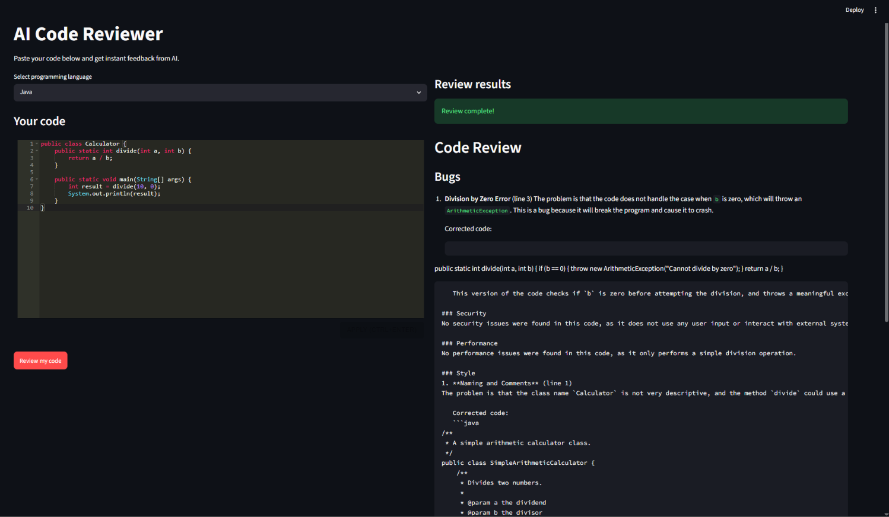

# AI Code Reviewer

> AI-powered code review tool built with Streamlit and Groq LLaMA



## Features

- Syntax-highlighted code editor (8 languages)
- Instant AI review powered by Groq LLaMA 3.3
- Side-by-side code + review layout
- Beginner-friendly feedback format

## Tech stack

Python · Streamlit · Groq API · streamlit-ace

## Setup

```bash
git clone https://github.com/Harini696/ai-code-reviewer.git
cd ai-code-reviewer
pip install -r requirements.txt
streamlit run app.py
```

## Contributors

- [@Harini696](https://github.com/Harini696)
- [@medhaveeraiyan-rgb](https://github.com/medhaveeraiyan-rgb)

## License

MIT
